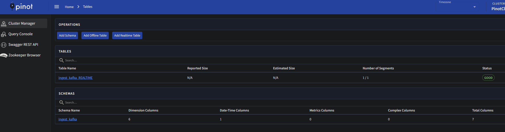
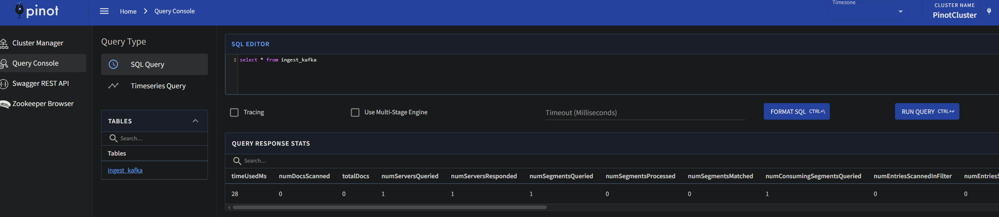
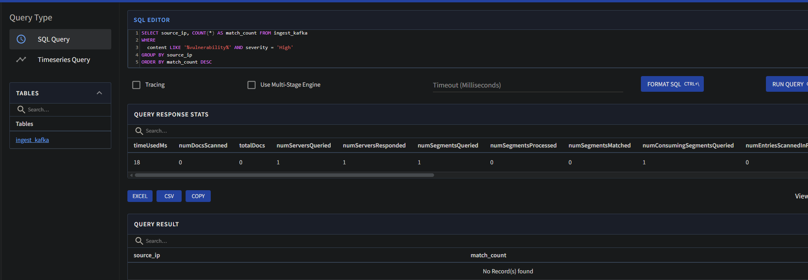
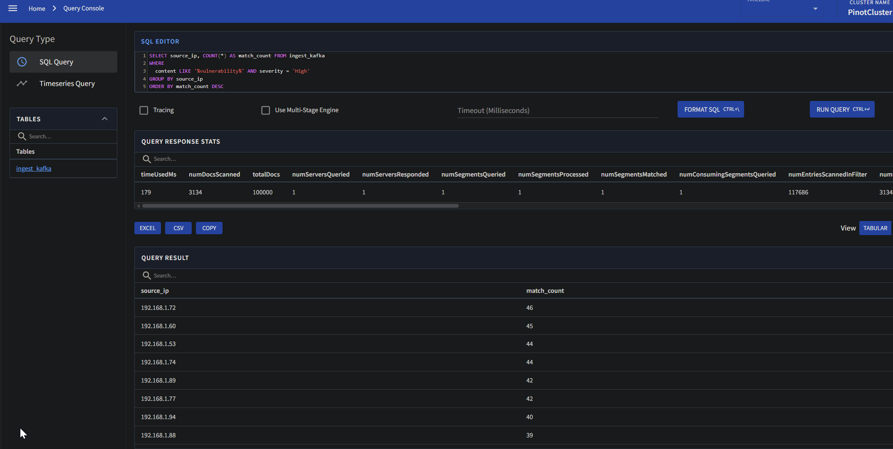
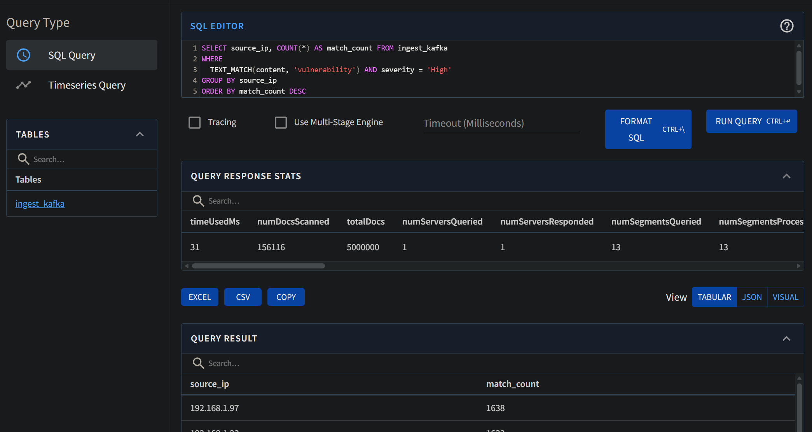

# Start the environment

Download the repository and start the environment:

```bash
docker compose up -d
```
## Verify the services
-Apache Pinot's Web UI: http://localhost:9000  

## Create a kafka topic:
```bash
docker exec \
  -t kafka kafka-topics.sh \
  --bootstrap-server localhost:9092 \
  --partitions=1 --replication-factor=1 \
  --create --topic ingest-kafka
```

# Learn more about Apache Pinot
- Apache Pinot's home page: https://docs.pinot.apache.org/ 

# Basic setup

Understand the content of [ingest schema file](ingest_kafka_schema.json) and [table creation file](ingest_kafka_realtime_table.json). Then, navigate to Apache Pinot's Web UI and add a table schema and a realtime table. 



Navigate to ```Query Console``` and run your first query:

```
select * from ingest_kafka
```



More advanced query:

```
SELECT source_ip, COUNT(*) AS match_count FROM ingest_kafka
WHERE
  content LIKE '%vulnerability%' AND severity = 'High'
GROUP BY source_ip
ORDER BY match_count DESC    
```



See more about queries' syntax: https://docs.pinot.apache.org/users/user-guide-query

What are we missing when we execute the queries?
- There is no data in Pinot at the moment.

See how to ingest data on Apache Pinot: https://docs.pinot.apache.org/manage-data/data-import

# Load generator
Inside the ```load-generator``` folder, understand the content of the docker compose file and start generating log records: 
```bash
docker compose up -d
```

What is the relation between these records being generated and Apache Pinot's table?
- The load generator creates synthetic log which are send to the Kafka topic ingest-kafka
- Two ingestion variants
  - Schema: pinot consumes the ingest-kafka topic and structures the messages according to the json schema provided
  - Real-time: records are continiously cosumed from Kafka and structured according to realtime json



Run again the advanced query:

```
SELECT source_ip, COUNT(*) AS match_count FROM ingest_kafka
WHERE
  content LIKE '%vulnerability%' AND severity = 'High'
GROUP BY source_ip
ORDER BY match_count DESC
```


Are there any changes in query results? What and why?

**Yes, now there is data.**

**Before load generator:**
- Query returned 0 rows
- Result was empty because no data existed in Pinot yet

**After load generator:**
- Query returns actual results with source IPs and their match counts
- Shows multiple source_ip values with varying counts of high-severity vulnerability logs
- Results continue to grow in real-time as the generator produces more records

**Why these changes occur:**
1. Load generator sends records to Kafka topic ingest-kafka
2. Pinot consumes these records immediately from Kafka
3. When the query is executed one gets the result
4. As the generator is still running, the result set grows with each query execution (with time)

Moreover, what is the amount of data in the table?

**Total Documents:** 5 000 000 records in the ingest_kafka table
- This represents the amount of data ingested from Kafka at the time of query execution
- The generator has finished running before the query was executed

**Metrics**
- **Docs scanned (156 116):** Records that matched the WHERE clause filters (content `LIKE '%vulnerability%'` AND `severity = 'High'`)
- **Entries scanned in filter (5 885 347):** Total character/field comparisons performed during filtering phase
- **Segments (13):** Number of data segments queried, processed, and matched - Pinot created 13 segments to store 5M records
- **Total table size (5 000 000):** Total number of documents in the ingest_kafka table

How this last query relates to the Spark Structured Streaming logs processing example from Exercise 3?

Both achieve a similar/the same result using different query methods:

**Key differences highlighted:**

Architecture:
- Spark: Code-based stream processing with DataFrames/RDDs
- Pinot: SQL-based OLAP with automatic indexing

Query model:
- Spark: Write Python transformation logic, deploy as jobs
- Pinot: Ad-hoc SQL queries, no code deployment needed

State management:
- Spark: Manual watermarking and windowing configuration
- Pinot: Automatic segment management and time-based queries

Latency:
- Spark: Micro-batch (seconds) with periodic writes
- Pinot: True real-time with sub-second query response

Use cases:
- Spark: Complex ETL, ML pipelines, multi-stage transformations
- Pinot: Interactive analytics, dashboards, real-time reporting

How performant is the advanced query? How long it takes to run and how many queries like this one could be served per second?

**Query speed:** 
- One run takes 4 852 ms (~ 4.9 seconds) for analytical query on 5M records with filtering and aggregation
- So approximatelly 0.2 such queries can be served per second

Practical Exercise: From the material presented in the previous lecture on ``` Analytical Processing``` and Apache Pinot's features (available at https://docs.pinot.apache.org/ ), analyze and explain how the performance of the advanced query could be improved without demanding additional computing resources. Then, implement and demonstrate such an approach in Apache Pinot.

### Analysis: Query Performance Bottleneck

**Bottlenecks:**
- Most time spent scanning entries in filter phase
- The `LIKE '%vulnerability%'` pattern matching is the main cost
- Post-filter processing is very fast compared to pattern matching

The `LIKE '%vulnerability%'` clause is the performance killer because:
1. Pinot must scan every character in every `content` value
2. No existing index accelerates substring matching
3. Scales linearly with data growth

### Solution: Add Index and use Text Match
**Add a text index** to enable fast substring/keyword searches without scanning every character in every record

### Implementation Steps
#### Step 1: Update Table Configuration
Modify `ingest_kafka_realtime_table.json` to add text index:

```json
{
  "tableName": "ingest_kafka",
  "tableType": "REALTIME",
  "segmentsConfig": {
    "timeType": "MILLISECONDS",
    "schemaName": "ingest_kafka",
    "timeColumnName": "timestamp",
    "replicasPerPartition": "1"
  },
  "tenants": {},
  "tableIndexConfig": {
    "loadMode": "MMAP",
    "noDictionaryColumns": [
      "content"
    ],
    "streamConfigs": {
      "streamType": "kafka",
      "stream.kafka.topic.name": "ingest-kafka",
      "stream.kafka.decoder.class.name": "org.apache.pinot.plugin.inputformat.json.JSONMessageDecoder",
      "stream.kafka.consumer.factory.class.name": "org.apache.pinot.plugin.stream.kafka20.KafkaConsumerFactory",
      "stream.kafka.broker.list": "kafka:9092",
      "realtime.segment.flush.threshold.rows": "0",
      "realtime.segment.flush.threshold.time": "24h",
      "realtime.segment.flush.threshold.segment.size": "50M",
      "stream.kafka.consumer.prop.auto.offset.reset": "smallest"
    }
  },
  "fieldConfigList": [
    {
      "name": "content",
      "encodingType": "RAW",
      "indexTypes": [
        "TEXT"
      ]
    }
  ],
  "metadata": {
    "customConfigs": {}
  }
}
```

**Key changes:**
- Added "noDictionaryColumns": ["content"] - Stores raw text values without dictionary encoding for efficient text indexing
- Added "fieldConfigList" - Defines index configuration for the content field
- Added "encodingType": "RAW" - Uses raw encoding instead of dictionary encoding (required for TEXT index)
- Added "indexTypes": ["TEXT"] - Creates TEXT index on content field (enables TEXT_MATCH queries)

#### Step 2: Update Table in Pinot Web UI
1. Navigate to http://localhost:9000
2. Go to tables and delete or edit the existing table
3. Replace the Table Configuration JSON with the updated version above

#### Step 3: Update query:
```sql
SELECT source_ip, COUNT(*) AS match_count FROM ingest_kafka
WHERE
  TEXT_MATCH(content, 'vulnerability') AND severity = 'High'
GROUP BY source_ip
ORDER BY match_count DESC
```

#### Step 4: Verify Performance difference
**Before Optimization:** (takes 4 852 ms)


**After Optimization:** (takes 31 ms)


### Why This Works Without Additional Resources
- Uses existing server memory for index structures
- Pinot maintains index as new data arrives from Kafka
- Dramatic performance improvements through intelligent indexing without requiring infrastructure changes

Foundational Exercise: Considering the material presented in the lecture ``` NoSQL - Data Processing & Advanced Topics``` and Apache Pinot's concepts https://docs.pinot.apache.org/basics/concepts and architecture https://docs.pinot.apache.org/basics/concepts/architecture, how an OLAP system such as Apache Pinot relates to NoSQL and realizes Sharding, Replication, and Distributed SQL?

### Pinot as a NoSQL OLAP System
**Relationship to NoSQL:**
- Pinot is a distributed NoSQL system designed for OLAP
- Optimized for high-throughput read operations on large datasets rather than consistent writes
- Supports flexible schema with JSON documents from streaming sources (Kafka)
- Trades ACID consistency for eventual consistency and real-time performance
- Horizontal scalability across commodity servers instead of vertical scaling
- No rigid schema enforcement like traditional relational databases

### Sharding
**Definition:**
- Horizontal data partitioning across multiple servers
- Each shard holds a subset of the total data
- Queries execute in parallel on all shards simultaneously

**How it works in Pinot:**
- Data is distributed based on a partition key (e.g., source_ip)
- Hash-based partitioning: data is hashed and assigned to shards
- Multiple servers store different shards, reducing data per server

### Replication
**Definition:**
- Creating multiple copies of data across different servers
- Ensures data availability even if some servers fail

**How it works in Pinot:**
- Each shard is replicated across multiple servers (replication factor: 1, 2, or 3)
- Replica factor of 3 means 3 copies of each shard on different servers
- Broker automatically routes queries to available replicas

### Distributed SQL
**Definition:**
- Query execution coordinated across multiple servers with results merged at broker
- Broker acts as query coordinator, distributing work to data-holding servers

**How it works in Pinot:**
- Broker receives SQL query from client
- Determines which shards contain relevant data
- Routes query to all relevant shard servers in parallel
- Each server applies filters and performs aggregations locally
- Broker collects partial results and merges them
- Final result returned to client

**Benefits:**
- Sub-second query latency through parallel execution
- Network efficiency: filters and aggregations done on servers
- Automatic query optimization without application changes
- Linear scaling with cluster size

### How They Work Together
**Combined System:**
- **Sharding** divides data across servers for parallel processing
- **Replication** copies each shard on multiple servers for fault tolerance
- **Distributed SQL** coordinates query execution across all shards/replicas

### Comparison with Traditional Databases
- **RDBMS**: Centralized, vertical scaling, ACID consistency, slow analytics
- **Pinot**: Distributed, horizontal scaling, eventual consistency, fast analytics
- Pinot trades strong consistency for performance and scalability (acceptable for analytics)
- Real-time ingestion from Kafka instead of batch processing
- Designed specifically for OLAP workloads (aggregations, filtering, grouping)

## Expected Deliverables

Complete answers to all questions above, including brief analyses, configuration files, and performance metrics for the practical exercise.

## Clean up in the ```root folder``` and inside the ```load-generator``` folder. In both cases with the command:

```bash
docker compose down -v
```