# Create the kafka topic where the log records produced:
```bash
docker exec -it kafka kafka-topics.sh \
  --bootstrap-server localhost:9092 \
  --create \
  --topic logs \
  --partitions 2 \
  --replication-factor 1
```

# Attaching VS Code to the Spark Client container
Spark does **not** run on your host machine; it runs inside Docker containers. Attaching VS Code ensures:

* **Correct Spark version:** (4.0.0)
* **Correct Python environment**
* **Correct Kafka networking**
* **Identical setup for everyone**

> **Note:** VS Code becomes a remote UI for the `spark-client` container.

---

### Prerequisite
Install this VS Code extension on your host:
* **Dev Containers** (Microsoft)

---

### Attach to the running container
1. Open **VS Code**.
2. Open the **Command Palette**:
   * `Ctrl + Shift + P` (Linux/Windows)
   * `Cmd + Shift + P` (macOS)
3. Select: **Dev Containers: Attach to Running Container**.
4. Choose: **spark-client**.

*VS Code will reload automatically.*

---

### Verify attachment
1. Look at the **bottom-left corner** of VS Code. It should display:
   `Dev Container: spark-client`
2. Open a terminal in VS Code and run:
   ```bash
   spark-submit --version
    ```
3. open the folder ```/opt/spark-apps/```
# Understanding the Spark Structured Streaming code
Revise the Spark Structured Streaming application example: ```spark_structured_streaming_logs_processing.py```

# Running the Spark Structured Streaming application

In the spark-client terminal, example of how to run the Spark application:

```bash
spark-submit \
  --master spark://spark-master:7077 \
  --packages org.apache.spark:spark-sql-kafka-0-10_2.13:4.0.0 \
  --num-executors 1 \
  --executor-cores 1 \
  --executor-memory 1G \
  /opt/spark-apps/spark_structured_streaming_logs_processing.py  
```

```bash
┌────────────────────────┐
│    Spark Client        │
│  spark-submit          │
│  (user machine / pod)  │
└───────────┬────────────┘
            │
            │ 1) submit application
            │
            ▼
┌────────────────────────┐
│     Spark Master       │
│  (Cluster Manager)    │
│                        │
│  - registers app       │
│  - allocates workers   │
└───────────┬────────────┘
            │
            │ 2) start executors
            │
   ┌────────┴─────────┬──────────┐
   ▼                  ▼          ▼
┌───────────┐   ┌───────────┐  ┌───────────┐
│ Worker 1  │   │ Worker 2  │  │ Worker N  │
│ Executor  │   │ Executor  │  │ Executor  │
└───────────┘   └───────────┘  └───────────┘
```

See the application submission in the Spark Master: http://localhost:8080
If there are no crashes, the Spark Driver should be reacheable: http://localhost:4040 

Note that the python application stored locally is submitted to the spark master's URL. Also note number of executors, cores per executors, and memory management. 
# Running the logs producer (load generator). This should generate the data that the Spark application processes.


Inside the ```load-generator``` folder, revise the ```docker-compose.yaml``` file, especially the number of messages generated per second. To start the load generator:

```bash
docker compose up -d
```

# Activity 1: Understanding the execution of Spark applications 

**Ilustration:**
```bash
                             +-----------------------+
                             |     Spark Driver      |
                             |----------------------|
                             | - Job scheduling     |
                             | - DAG management     |
                             | - Resource tracking  |
                             +-----------------------+
                                         |
                                         v
                               +-----------------+
                               |   Worker 1      |
                               |-----------------|
                               |  +-----------+  |
                               |  | Executor 1|  |
                               |  |-----------|  |
                               |  | Job 1     |  |
                               |  | Stage 1   |  |
                               |  |  * Task0  |  |
                               |  |  * Task1  |  |
                               |  | Stage 2   |  |
                               |  |  * Task0  |  |
                               |  |  * Task1  |  |
                               |  +-----------+  |
                               +-----------------+
                               +-----------------+
                               |   Worker 2      |
                               |-----------------|
                               |  +-----------+  |
                               |  | Executor 2|  |
                               |  |-----------|  |
                               |  | Job 2     |  |
                               |  | Stage 1   |  |
                               |  |  * Task0  |  |
                               |  |  * Task1  |  |
                               |  | Stage 2   |  |
                               |  |  * Task0  |  |
                               |  |  * Task1  |  |
                               |  +-----------+  |
                               +-----------------+

Kafka Input Topic
+---------------+ +---------------+  +----------------+
|Partition0 (P0)| |Partition1 (P1)|  |Partition2 (P2) |
+---------------+ +---------------+  +----------------+
       |              |              |
       v              v              v
     +-----------------------------------+
     |          Dataflow DAG             |
     |---------------------------------- |
     |Stage 1: Map/Filter/Parse (3 tasks)|
     |  Task0 (P0) -> Shuffle -> Stage2  |
     |  Task1 (P1) -> Shuffle -> Stage2  |
     |  Task2 (P2) -> Shuffle -> Stage2  |
     |                                   |
     |Stage 2: Aggregation/Join (2 tasks)|
     |     * Task0 <- shuffled data      |
     |     * Task1 <- shuffled data      |
     +-----------------------------------+
                    |
                    v
               +-----------+
               |  Sink     |
               |(Kafka,    |
               | HDFS, etc)|
               +-----------+

```
## 1. Accessing the Interface
Once your Spark application is running, the Web UI is hosted by the **Driver**: http://localhost:4040 

---

## 2. Key Concepts to Observe
As you navigate the UI, find and analyze the following sections to see Spark theory in action:

### A. The Jobs Tab & DAG Visualization
Every **Action** (like `.count()`, `.collect()`, or `.save()`) triggers a Spark Job. 
* **Task:** Click on a Job ID to see the **DAG Visualization**.
* **Concept:** Observe how Spark groups operations. Transformations like `map` or `filter` stay in one stage, while `sort` or `groupBy` create new stages.

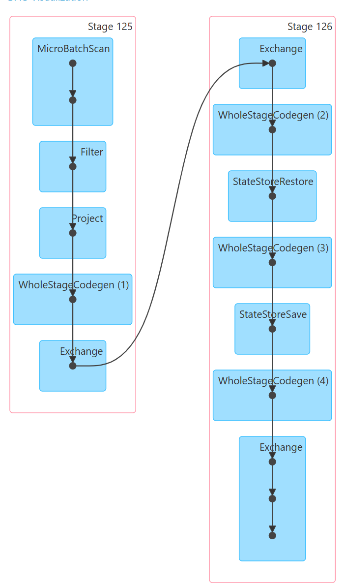

### Stages:
Stage 125
- MicroBatchScan: Read new data from Kafka for the current micro-batch.
- Filter: Keep only rows matching the filter condition.
- Project: Select or compute the needed columns.
- WholeStageCodegen: Compile filter + project into optimized JVM code.
- Exchange: Shuffle data to repartition by key for stateful processing.

Stage 126
- Exchange: Receive shuffled data for processing.
- WholeStageCodegen: Optimize initial computation on the batch.
- StateStoreRestore: Load previous state for stateful operations.
- WholeStageCodegen: Perform the main computation on the batch.
- StateStoreSave: Save updated state for fault tolerance.
- WholeStageCodegen: Final computation before output.
- Exchange: Repartition for writing to sink if needed.

### B. The Stages Tab
Stages represent a set of tasks that can be performed in parallel without moving data between nodes.
* **Concept:** Look for **Shuffle Read** and **Shuffle Write**. This represents data moving across the network—the most "expensive" part of distributed computing.

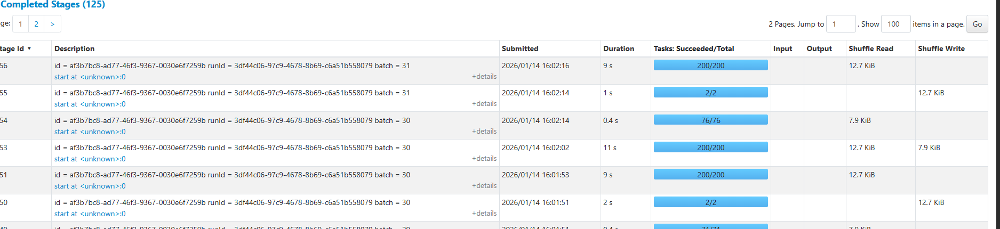

### C. The Executors Tab
This shows the "Workers" doing the actual computation.
* **Concept:** Check for **Data Skew**. If one executor has 10GB of Shuffle Read while others have 10MB, your data is not partitioned evenly.

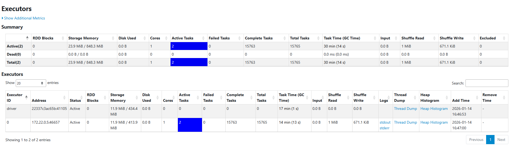

Only two executer one driver and one actual worker.

---

## 3. Practical Exploration Questions
While your application is running, try to answer these questions:
1.  **The Bottleneck:** Which Stage has the longest "Duration"? What are the technical reasons for it?
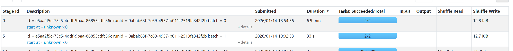
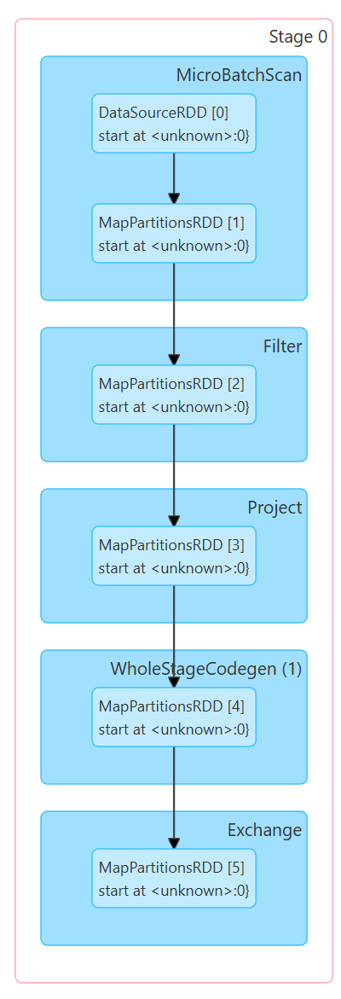

- Stage id 0 took 7 minutes:
   - MicroBatchScan (Kafka read) is the bottleneck
   - Reads all available Kafka offsets since last batch
   - The generator produces 10,000 msgs/sec
   - Backlog accumulates --> each batch grows

2.  **Resource Usage:** In the Executors tab, how much memory is currently being used versus the total capacity?
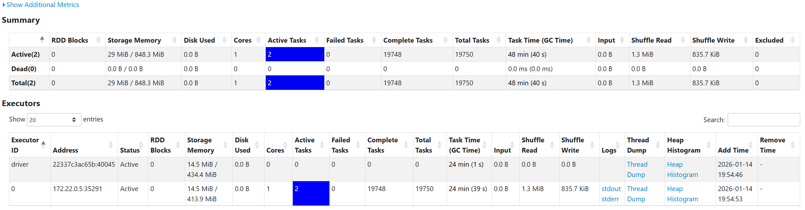

- 29.0 MiB of 848.3 MiB are used at the moment

3. Explain with your own words the main concepts related to performance and scalability in the scenario of Spark Structured Streaming.

- Micro-batching for efficient execution:
   - Instead of processing each event individually, Spark groups records into micro-batches.
   - This improves performance because:
      - Task scheduling overhead is amortized over many records
      - JVM and code-generation optimizations apply to batches
      - Network and I/O operations are more efficient in bulk

- Parallel execution through partitioning:
   - Spark improves performance by splitting the data into partitions and processing them in parallel.
      - Kafka topics are divided into partitions
      - Each partition can be read by a separate Spark task
      - Tasks run concurrently on different executor cores

- Shuffle optimization and controlled data movement
   - Writes intermediate data in a compressed, serialized format
   - Uses efficient network transfer mechanisms
   - Allows tuning of shuffle partitions

- State mangement 
   - For stateful streaming queries, Spark maintains intermediate results across micro-batches.
   - State enables advanced analytics such as windowed aggregations
   - Spark stores state in a fault-tolerant StateStore backed by disk
   - Memory is used aggressively to cache hot state and reduce I/O

- Scalability Mechanisms
   - Spark Structured Streaming is designed to scale horizontally.
   - Adding executors across machines increases throughput
   - Kafka partitions enable parallel ingestion

#### Summary:
Spark Structured Streaming improves performance through micro-batch execution, optimized query plans, whole-stage code generation, and parallel processing across executors and partitions. Scalability is achieved by increasing cores, executors, memory, and Kafka partitions while tuning shuffle and state management parameters to match available hardware.

# Activity 2: Tuning for High Throughput

### The Challenge
Your goal is to scale your application to process **several hundred thousand events per second are processed with batch sizes under 20 seconds to maintain reasonable event latency and data freshness**. On a standard laptop (8 cores / 16 threads), it is possible to process **1 million records per second** with micro-batch latencies staying below 12 seconds. 

Please note that the ```TARGET_RPS=10000``` configuration in the docker compose file of the load generator. This value represents how many records per second each instance of the load generator should produce. The load generator can also run in parallel with multiple docker instances to increase the generation speed.

### The Baseline Configuration
Review the starting configuration below. Identify which parameters are limiting the application's ability to use your hardware's full potential: 

From the previous example of how to run the Spark application:

```bash
spark-submit \
  --master spark://spark-master:7077 \
  --packages org.apache.spark:spark-sql-kafka-0-10_2.13:4.0.0 \
  --num-executors 1 \
  --executor-cores 1 \
  --executor-memory 1G \
  /opt/spark-apps/spark_structured_streaming_logs_processing.py  
```

- Limits:
   - --num-executors 1
      - Limits the application to a single executor
      - Prevents horizontal parallelism across multiple CPUs or machines
      - Even if the host has many cores, Spark can only run on one executor JVM
   - --executor-cores 1
      - Allows only one task to run at a time within the executor
      - Spark cannot process multiple partitions concurrently
      - Kafka partitions, shuffle partitions, and tasks are processed serially
   - --executor-memory 1G
      - Restricts how much data can be kept in memory
      - Forces shuffle and state data to spill to disk
      - Increases I/O overhead during aggregations and joins
- Result:
   - Even on a multi-core machine, most CPU and memory resources remain unused.

### Tuning Configurations (The "Knobs")
You must decide how to adjust the configurations to increase the performance. Consider the relationship between your **CPU threads**, **RAM availability**, and **Parallelism**. Examples of configurations

| Parameter | Impact on Performance |
| :--- | :--- |
| `--num-executors` | Defines how many parallel instances (executors) run. |
| `--executor-cores` | Defines how many tasks can run in parallel on a single executor. |
| `--executor-memory` | Affects the ability to handle large micro-batches and shuffles in RAM. |
| `--conf "spark.sql.shuffle.partitions=2"` | Controls how many partitions are created during shuffles. |

---

See full configuration: https://spark.apache.org/docs/latest/submitting-applications.html and general configurations: https://spark.apache.org/docs/latest/configuration.html. Also check possible configurations with:

   ```bash
   spark-submit --help
   ```

Updated the Spark resources to improve streaming job performance and handle larger workloads 
- Increased `--executor-cores` from 1 to 16 which allows for parallelized processing
- Increased `--executor-memory` from 1G to 4G which allows for more caching
- Kept `--num-executors` at 1 since it is only running on one pysical machine

Update docker compose
```bash
services:
  generator:
    image: adrianovogel/hgb-load-gen:latest
    extra_hosts:
      - "host.docker.internal:host-gateway"
    environment:
      - KAFKA_BROKER=host.docker.internal:9095
      - KAFKA_TOPIC=logs
      - TARGET_RPS=60000
      - ADDITIONAL_TERM=crash
      - ADDITIONAL_TERM_RATE=100
    deploy:
      replicas: 4  # This enables to run more instances (containers)
      resources:
        limits:
          memory: 1024M  
          cpus: '1'
    networks:
      - streaming-net

networks:
  streaming-net:
    external: true
    name: streaming-net
```

```bash
  spark-worker:
    image: bitnamilegacy/spark:4.0.0
    depends_on:
      - spark-master
    environment:
      - SPARK_MODE=worker
      - SPARK_MASTER_URL=spark://spark-master:7077
      - SPARK_WORKER_CORES=16
      - SPARK_WORKER_MEMORY=4G
    networks:
      - streaming-net
    deploy:
      replicas: 1
      resources:
        limits:
          memory: 4096M  
          cpus: '16'
```

Updated parameters to use more compute power:
```bash
spark-submit \
  --master spark://spark-master:7077 \
  --packages org.apache.spark:spark-sql-kafka-0-10_2.13:4.0.0 \
  --num-executors 1 \
  --executor-cores 16 \
  --executor-memory 4G \
  /opt/spark-apps/spark_structured_streaming_logs_processing.py
```

### Monitoring 
Navigate to the **Structured Streaming Tab** in the UI to monitor the performance:

####  * **Input Rate vs. Process Rate:** 
If your input rate is consistently higher than your process rate, your application is failing to keep up with the data stream.

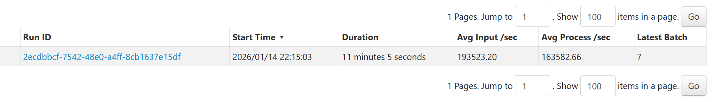
- Average input/sec: 193523.20
- Average process/sec: 163582.66

**Unfortunatelly I was unable to push it any higher as windows started to lagg and working got really difficult.**

#### The Executors Tab
In the The Executors Tab, check the **"Thread Dump"** and **"Task"** columns to verify resource utilization.

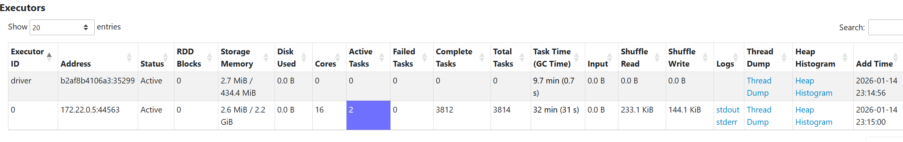

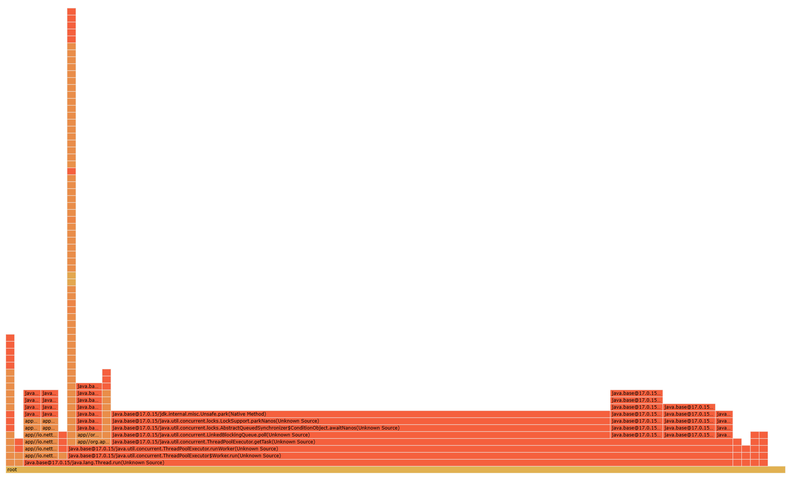

#### The SQL/Queries Tab
Click on the active query to see the **DAG (Directed Acyclic Graph)**.
* **Identify "Shuffle" Boundaries:** Look for the exchange points where data is redistributed across the cluster.


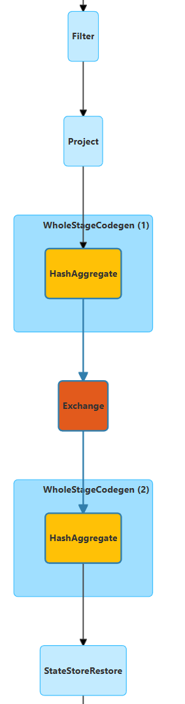

* **Identify Data Skew:** Is data being distributed evenly across all your cores, or are a few tasks doing all the work? Use the DAG to pinpoint which specific transformation is causing a bottleneck.

Job 0:

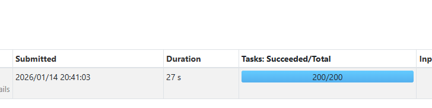
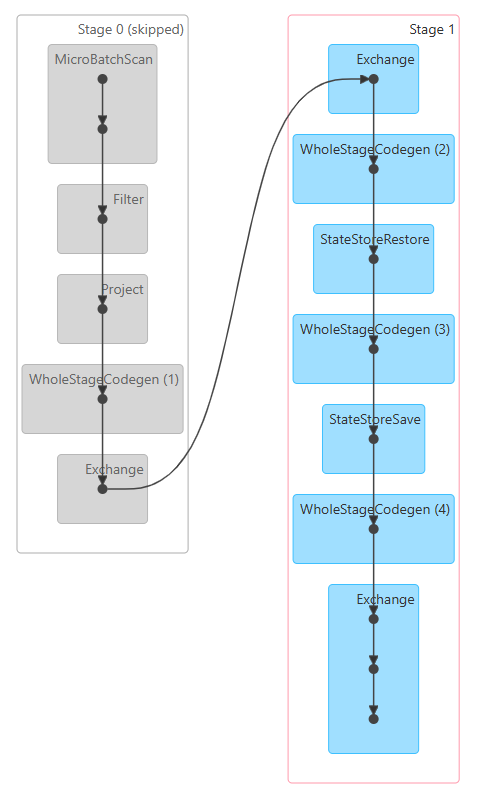

Job 1:

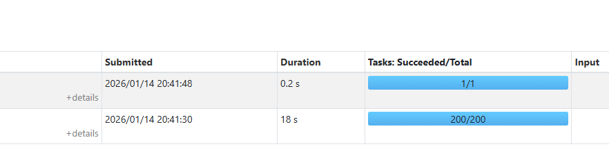
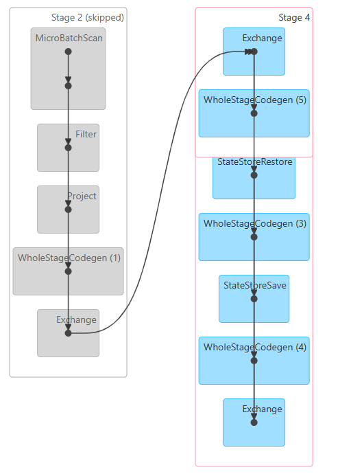

The load is somewhat equally distributed. The slower job 0 DAG features more exchange steps at the end compared to job 1.

* **Submit activities 1 and 2 (answers and evidences) via Moodle until 20.01.2026**

# Activity 3 - Monitoring user experience in near real-time
## Technical Specification: Event Aggregation Logic

### Scenario: Continuous reporting of critical crash events

**Given** a stream of incoming event logs  
**When** a log entry has a `content` field containing the substring "crash"  
**And** the `severity` value is either "High" or "Critical"  
**And** logs are grouped by the `user_id` field, such as the crash count per `user_id`
**And** the system aggregates these occurrences in **10-second intervals** based strictly on the event `timestamp` field  
**Then** the system must output the aggregated results for each interval as they complete **When** the crash count of a given `user_id` is higher than 2 per interval.

#### Implementation Notes:
* Ensure the search for "crash" handles case sensitivity according to project standards.
* The 10-second interval logic must be tied to the record's metadata (`timestamp`), not the system arrival time.

#### Example of output
   ```bash
-------------------------------------------
Batch: 12
-------------------------------------------
+------------------------------------------+---------+-----------+
|Interval                                  |user_id  |crash_count|
+------------------------------------------+---------+-----------+
|{2026-01-11 14:42:50, 2026-01-11 14:43:00}|user_1836|5          |
|{2026-01-11 14:42:50, 2026-01-11 14:43:00}|user_1184|3          |
|{2026-01-11 14:42:50, 2026-01-11 14:43:00}|user_1946|3          |
|{2026-01-11 14:42:50, 2026-01-11 14:43:00}|user_1551|3          |
|{2026-01-11 14:42:50, 2026-01-11 14:43:00}|user_1841|3          |
|{2026-01-11 14:42:50, 2026-01-11 14:43:00}|user_1287|3          |
|{2026-01-11 14:42:50, 2026-01-11 14:43:00}|user_1028|3          |
|{2026-01-11 14:42:50, 2026-01-11 14:43:00}|user_1288|3          |
+------------------------------------------+---------+-----------+
```

## 2. Non-Functional Requirements
* **Scalability:** The architecture must support horizontal scaling, allowing the logic to be distributed across a cluster of multiple machines.
* **Fault Tolerance:** The system must support recovery in the event of infrastructure failure of the worker nodes.

## Deliverables for Activity 3

You are required to submit your application source code accompanied by a technical discussion. This discussion must explain how your specific implementation satisfies the requirements, including a discussion on your solution could handle the scenario of late-arriving records that can appear after a 10-second interval has concluded. Furthermore, you must provide a performance and scalability report that evaluates the performance and efficiency of your solution and discuss its ability to execute effectively across a multi-machine environment. Submit via Moodle until 27.01.2026

# Delete the topic where the log records were produced:
```bash
docker exec -it kafka kafka-topics.sh \
  --bootstrap-server localhost:9092 \
  --delete \
  --topic logs 
```

## Step 1: Prepare Kafka Topic
```bash
docker exec -it kafka kafka-topics.sh \
  --bootstrap-server localhost:9092 \
  --create \
  --topic logs \
  --partitions 4 \
  --replication-factor 1
```

## Step 2: Ensure load generator is started
```bash
cd load-generator
docker compose up -d
```

## Step 3: Run the Spark Application

Configuration Used:

| Parameter | Value | Purpose |
|-----------|-------|----------|
| `num-executors` | 1 | Single-node deployment |
| `executor-cores` | 8 | Parallel task execution |
| `executor-memory` | 4G | State storage + processing |
| Kafka partitions | 4 | Parallel ingestion |
| `shuffle.partitions` | 16 (default) | 2× executor cores |

Key Parameters for the Python Script:

| Parameter | Default | Purpose |
|-----------|---------|---------|
| `WINDOW_DURATION` | 10 seconds | Tumbling window size |
| `WATERMARK_DELAY` | 30 seconds | Late arrival tolerance |
| `startingOffsets` | latest | Kafka read position |
| `outputMode` | update | Stream output mode |


Run the script inside the spark client (connect to container via VS Code):
```bash
spark-submit \
  --master spark://spark-master:7077 \
  --packages org.apache.spark:spark-sql-kafka-0-10_2.13:4.0.0 \
  --num-executors 1 \
  --executor-cores 8 \
  --executor-memory 4G \
  /opt/spark-apps/spark_crash_monitoring.py
```

## Step 4: Monitor the Application

### Spark Web UI
- **Driver**: http://localhost:4040

### Key Tabs to Monitor:
1. **Structured Streaming** - Batch processing times, input/output rates
2. **SQL** - Query DAG and execution plan
3. **Executors** - Resource utilization

## Step 5: Interpret the Output
Output:
```
-------------------------------------------
Batch: 0
-------------------------------------------
+--------+-------+-----------+
|Interval|user_id|crash_count|
+--------+-------+-----------+
+--------+-------+-----------+

-------------------------------------------
Batch: 1
-------------------------------------------
+------------------------------------------+---------+-----------+
|Interval                                  |user_id  |crash_count|
+------------------------------------------+---------+-----------+
|{2026-01-20 13:53:00, 2026-01-20 13:53:10}|user_1361|3          |
|{2026-01-20 13:53:00, 2026-01-20 13:53:10}|user_1424|6          |
|{2026-01-20 13:53:10, 2026-01-20 13:53:20}|user_1631|6          |
|{2026-01-20 13:53:10, 2026-01-20 13:53:20}|user_1987|4          |
|{2026-01-20 13:53:20, 2026-01-20 13:53:30}|user_1411|3          |
|{2026-01-20 13:52:50, 2026-01-20 13:53:00}|user_1281|3          |
|{2026-01-20 13:52:50, 2026-01-20 13:53:00}|user_1497|3          |
|{2026-01-20 13:52:50, 2026-01-20 13:53:00}|user_1568|3          |
|{2026-01-20 13:53:00, 2026-01-20 13:53:10}|user_1588|3          |
|{2026-01-20 13:53:10, 2026-01-20 13:53:20}|user_1886|3          |
|{2026-01-20 13:53:10, 2026-01-20 13:53:20}|user_1356|6          |
|{2026-01-20 13:53:10, 2026-01-20 13:53:20}|user_1083|5          |
|{2026-01-20 13:53:00, 2026-01-20 13:53:10}|user_1086|5          |
|{2026-01-20 13:53:10, 2026-01-20 13:53:20}|user_1696|9          |
|{2026-01-20 13:53:10, 2026-01-20 13:53:20}|user_1412|3          |
|{2026-01-20 13:53:10, 2026-01-20 13:53:20}|user_1526|3          |
|{2026-01-20 13:53:10, 2026-01-20 13:53:20}|user_1038|3          |
|{2026-01-20 13:53:20, 2026-01-20 13:53:30}|user_1728|3          |
|{2026-01-20 13:53:20, 2026-01-20 13:53:30}|user_1690|3          |
|{2026-01-20 13:53:20, 2026-01-20 13:53:30}|user_1282|3          |
|{2026-01-20 13:53:00, 2026-01-20 13:53:10}|user_1840|3          |
|{2026-01-20 13:53:10, 2026-01-20 13:53:20}|user_1889|4          |
|{2026-01-20 13:53:10, 2026-01-20 13:53:20}|user_1458|6          |
|{2026-01-20 13:53:10, 2026-01-20 13:53:20}|user_1266|8          |
|{2026-01-20 13:53:20, 2026-01-20 13:53:30}|user_1404|5          |
|{2026-01-20 13:53:20, 2026-01-20 13:53:30}|user_1353|3          |
|{2026-01-20 13:53:20, 2026-01-20 13:53:30}|user_1562|3          |
|{2026-01-20 13:53:20, 2026-01-20 13:53:30}|user_1891|3          |
|{2026-01-20 13:53:00, 2026-01-20 13:53:10}|user_1138|4          |
|{2026-01-20 13:53:00, 2026-01-20 13:53:10}|user_1878|3          |
|{2026-01-20 13:53:10, 2026-01-20 13:53:20}|user_1585|3          |
|{2026-01-20 13:53:10, 2026-01-20 13:53:20}|user_1189|8          |
|{2026-01-20 13:53:20, 2026-01-20 13:53:30}|user_1172|6          |
|{2026-01-20 13:53:20, 2026-01-20 13:53:30}|user_1207|3          |
|{2026-01-20 13:53:20, 2026-01-20 13:53:30}|user_1704|4          |
|{2026-01-20 13:52:50, 2026-01-20 13:53:00}|user_1668|3          |
|{2026-01-20 13:53:00, 2026-01-20 13:53:10}|user_1709|4          |
|{2026-01-20 13:53:00, 2026-01-20 13:53:10}|user_1391|4          |
|{2026-01-20 13:53:00, 2026-01-20 13:53:10}|user_1740|4          |
|{2026-01-20 13:53:00, 2026-01-20 13:53:10}|user_1522|3          |
|{2026-01-20 13:53:10, 2026-01-20 13:53:20}|user_1180|3          |
|{2026-01-20 13:53:10, 2026-01-20 13:53:20}|user_1671|7          |
|{2026-01-20 13:53:10, 2026-01-20 13:53:20}|user_1080|5          |
|{2026-01-20 13:53:10, 2026-01-20 13:53:20}|user_1153|5          |
|{2026-01-20 13:52:50, 2026-01-20 13:53:00}|user_1853|3          |
|{2026-01-20 13:52:50, 2026-01-20 13:53:00}|user_1137|3          |
|{2026-01-20 13:52:50, 2026-01-20 13:53:00}|user_1791|3          |
|{2026-01-20 13:53:00, 2026-01-20 13:53:10}|user_1096|4          |
|{2026-01-20 13:53:10, 2026-01-20 13:53:20}|user_1316|6          |
|{2026-01-20 13:53:10, 2026-01-20 13:53:20}|user_1843|8          |
|{2026-01-20 13:53:10, 2026-01-20 13:53:20}|user_1097|5          |
|{2026-01-20 13:53:10, 2026-01-20 13:53:20}|user_1587|3          |
|{2026-01-20 13:53:20, 2026-01-20 13:53:30}|user_1889|5          |
|{2026-01-20 13:53:20, 2026-01-20 13:53:30}|user_1036|3          |
|{2026-01-20 13:53:00, 2026-01-20 13:53:10}|user_1725|3          |
|{2026-01-20 13:53:00, 2026-01-20 13:53:10}|user_1037|3          |
|{2026-01-20 13:52:50, 2026-01-20 13:53:00}|user_1614|3          |
|{2026-01-20 13:53:00, 2026-01-20 13:53:10}|user_1213|3          |
|{2026-01-20 13:53:00, 2026-01-20 13:53:10}|user_1495|5          |
|{2026-01-20 13:53:10, 2026-01-20 13:53:20}|user_1030|5          |
|{2026-01-20 13:53:10, 2026-01-20 13:53:20}|user_1602|11         |
|{2026-01-20 13:53:10, 2026-01-20 13:53:20}|user_1592|3          |
|{2026-01-20 13:53:20, 2026-01-20 13:53:30}|user_1856|3          |
|{2026-01-20 13:53:20, 2026-01-20 13:53:30}|user_1733|3          |
|{2026-01-20 13:53:20, 2026-01-20 13:53:30}|user_1637|6          |
|{2026-01-20 13:53:20, 2026-01-20 13:53:30}|user_1418|5          |
|{2026-01-20 13:53:00, 2026-01-20 13:53:10}|user_1286|3          |
|{2026-01-20 13:52:50, 2026-01-20 13:53:00}|user_1440|4          |
|{2026-01-20 13:53:00, 2026-01-20 13:53:10}|user_1678|3          |
|{2026-01-20 13:53:10, 2026-01-20 13:53:20}|user_1107|7          |
|{2026-01-20 13:53:10, 2026-01-20 13:53:20}|user_1447|6          |
|{2026-01-20 13:53:10, 2026-01-20 13:53:20}|user_1591|5          |
|{2026-01-20 13:53:20, 2026-01-20 13:53:30}|user_1971|6          |
|{2026-01-20 13:53:20, 2026-01-20 13:53:30}|user_1339|3          |
|{2026-01-20 13:53:00, 2026-01-20 13:53:10}|user_1689|3          |
|{2026-01-20 13:52:50, 2026-01-20 13:53:00}|user_1933|3          |
|{2026-01-20 13:53:00, 2026-01-20 13:53:10}|user_1687|4          |
|{2026-01-20 13:53:00, 2026-01-20 13:53:10}|user_1887|4          |
|{2026-01-20 13:53:00, 2026-01-20 13:53:10}|user_1291|3          |
|{2026-01-20 13:53:10, 2026-01-20 13:53:20}|user_1318|3          |
|{2026-01-20 13:53:10, 2026-01-20 13:53:20}|user_1376|5          |
|{2026-01-20 13:53:10, 2026-01-20 13:53:20}|user_1686|6          |
|{2026-01-20 13:53:10, 2026-01-20 13:53:20}|user_1563|4          |
|{2026-01-20 13:53:10, 2026-01-20 13:53:20}|user_1915|8          |
|{2026-01-20 13:53:20, 2026-01-20 13:53:30}|user_1397|5          |
|{2026-01-20 13:53:20, 2026-01-20 13:53:30}|user_1031|3          |
|{2026-01-20 13:52:50, 2026-01-20 13:53:00}|user_1225|6          |
|{2026-01-20 13:53:10, 2026-01-20 13:53:20}|user_1543|4          |
|{2026-01-20 13:53:10, 2026-01-20 13:53:20}|user_1734|5          |
|{2026-01-20 13:53:10, 2026-01-20 13:53:20}|user_1572|6          |
|{2026-01-20 13:53:10, 2026-01-20 13:53:20}|user_1391|3          |
|{2026-01-20 13:53:10, 2026-01-20 13:53:20}|user_1456|3          |
|{2026-01-20 13:53:20, 2026-01-20 13:53:30}|user_1574|3          |
|{2026-01-20 13:53:20, 2026-01-20 13:53:30}|user_1092|4          |
|{2026-01-20 13:53:20, 2026-01-20 13:53:30}|user_1026|4          |
|{2026-01-20 13:52:50, 2026-01-20 13:53:00}|user_1088|3          |
|{2026-01-20 13:53:10, 2026-01-20 13:53:20}|user_1041|4          |
|{2026-01-20 13:53:20, 2026-01-20 13:53:30}|user_1243|4          |
|{2026-01-20 13:52:50, 2026-01-20 13:53:00}|user_1084|3          |
|{2026-01-20 13:53:10, 2026-01-20 13:53:20}|user_1701|3          |
+------------------------------------------+---------+-----------+
only showing top 100 rows
-------------------------------------------
Batch: 2
-------------------------------------------
+------------------------------------------+---------+-----------+
|Interval                                  |user_id  |crash_count|
+------------------------------------------+---------+-----------+
|{2026-01-20 13:53:20, 2026-01-20 13:53:30}|user_1411|5          |
|{2026-01-20 13:53:20, 2026-01-20 13:53:30}|user_1976|3          |
|{2026-01-20 13:53:30, 2026-01-20 13:53:40}|user_1602|3          |
|{2026-01-20 13:53:30, 2026-01-20 13:53:40}|user_1300|6          |
|{2026-01-20 13:53:30, 2026-01-20 13:53:40}|user_1269|4          |
|{2026-01-20 13:53:30, 2026-01-20 13:53:40}|user_1480|5          |
|{2026-01-20 13:53:30, 2026-01-20 13:53:40}|user_1443|3          |
|{2026-01-20 13:53:40, 2026-01-20 13:53:50}|user_1462|6          |
|{2026-01-20 13:53:40, 2026-01-20 13:53:50}|user_1885|4          |
|{2026-01-20 13:53:40, 2026-01-20 13:53:50}|user_1022|6          |
|{2026-01-20 13:53:40, 2026-01-20 13:53:50}|user_1696|6          |
|{2026-01-20 13:53:20, 2026-01-20 13:53:30}|user_1649|4          |
|{2026-01-20 13:53:20, 2026-01-20 13:53:30}|user_1112|5          |
|{2026-01-20 13:53:30, 2026-01-20 13:53:40}|user_1053|3          |
|{2026-01-20 13:53:40, 2026-01-20 13:53:50}|user_1042|4          |
|{2026-01-20 13:53:50, 2026-01-20 13:54:00}|user_1223|5          |
|{2026-01-20 13:53:50, 2026-01-20 13:54:00}|user_1774|3          |
|{2026-01-20 13:53:30, 2026-01-20 13:53:40}|user_1100|5          |
|{2026-01-20 13:53:50, 2026-01-20 13:54:00}|user_1693|4          |
|{2026-01-20 13:53:30, 2026-01-20 13:53:40}|user_1045|4          |
|{2026-01-20 13:53:30, 2026-01-20 13:53:40}|user_1425|5          |
|{2026-01-20 13:53:30, 2026-01-20 13:53:40}|user_1032|5          |
|{2026-01-20 13:53:30, 2026-01-20 13:53:40}|user_1187|5          |
|{2026-01-20 13:53:40, 2026-01-20 13:53:50}|user_1483|6          |
|{2026-01-20 13:53:40, 2026-01-20 13:53:50}|user_1789|3          |
|{2026-01-20 13:53:40, 2026-01-20 13:53:50}|user_1698|6          |
|{2026-01-20 13:53:50, 2026-01-20 13:54:00}|user_1981|3          |
|{2026-01-20 13:53:30, 2026-01-20 13:53:40}|user_1875|3          |
|{2026-01-20 13:53:30, 2026-01-20 13:53:40}|user_1898|3          |
|{2026-01-20 13:53:30, 2026-01-20 13:53:40}|user_1888|3          |
|{2026-01-20 13:53:30, 2026-01-20 13:53:40}|user_1354|4          |
|{2026-01-20 13:53:40, 2026-01-20 13:53:50}|user_1699|4          |
|{2026-01-20 13:53:20, 2026-01-20 13:53:30}|user_1282|4          |
|{2026-01-20 13:53:30, 2026-01-20 13:53:40}|user_1003|4          |
|{2026-01-20 13:53:30, 2026-01-20 13:53:40}|user_1393|5          |
|{2026-01-20 13:53:30, 2026-01-20 13:53:40}|user_1568|4          |
|{2026-01-20 13:53:40, 2026-01-20 13:53:50}|user_1206|5          |
|{2026-01-20 13:53:40, 2026-01-20 13:53:50}|user_1010|3          |
|{2026-01-20 13:53:50, 2026-01-20 13:54:00}|user_1104|5          |
|{2026-01-20 13:53:50, 2026-01-20 13:54:00}|user_1465|5          |
|{2026-01-20 13:53:50, 2026-01-20 13:54:00}|user_1268|3          |
|{2026-01-20 13:53:40, 2026-01-20 13:53:50}|user_1603|4          |
|{2026-01-20 13:53:40, 2026-01-20 13:53:50}|user_1008|3          |
|{2026-01-20 13:53:40, 2026-01-20 13:53:50}|user_1425|3          |
|{2026-01-20 13:53:20, 2026-01-20 13:53:30}|user_1404|6          |
|{2026-01-20 13:53:30, 2026-01-20 13:53:40}|user_1974|7          |
|{2026-01-20 13:53:30, 2026-01-20 13:53:40}|user_1529|3          |
|{2026-01-20 13:53:30, 2026-01-20 13:53:40}|user_1515|4          |
|{2026-01-20 13:53:30, 2026-01-20 13:53:40}|user_1029|7          |
|{2026-01-20 13:53:40, 2026-01-20 13:53:50}|user_1758|7          |
|{2026-01-20 13:53:40, 2026-01-20 13:53:50}|user_1989|5          |
|{2026-01-20 13:53:40, 2026-01-20 13:53:50}|user_1658|5          |
|{2026-01-20 13:53:40, 2026-01-20 13:53:50}|user_1088|4          |
|{2026-01-20 13:53:40, 2026-01-20 13:53:50}|user_1466|6          |
|{2026-01-20 13:53:40, 2026-01-20 13:53:50}|user_1050|4          |
|{2026-01-20 13:53:50, 2026-01-20 13:54:00}|user_1519|3          |
|{2026-01-20 13:53:20, 2026-01-20 13:53:30}|user_1353|4          |
|{2026-01-20 13:53:20, 2026-01-20 13:53:30}|user_1498|5          |
|{2026-01-20 13:53:20, 2026-01-20 13:53:30}|user_1562|6          |
|{2026-01-20 13:53:20, 2026-01-20 13:53:30}|user_1704|5          |
|{2026-01-20 13:53:30, 2026-01-20 13:53:40}|user_1552|3          |
|{2026-01-20 13:53:40, 2026-01-20 13:53:50}|user_1066|6          |
|{2026-01-20 13:53:40, 2026-01-20 13:53:50}|user_1434|5          |
|{2026-01-20 13:53:40, 2026-01-20 13:53:50}|user_1596|4          |
|{2026-01-20 13:53:50, 2026-01-20 13:54:00}|user_1733|4          |
|{2026-01-20 13:53:50, 2026-01-20 13:54:00}|user_1068|6          |
|{2026-01-20 13:53:30, 2026-01-20 13:53:40}|user_1873|6          |
|{2026-01-20 13:53:50, 2026-01-20 13:54:00}|user_1598|3          |
|{2026-01-20 13:53:50, 2026-01-20 13:54:00}|user_1565|3          |
|{2026-01-20 13:53:20, 2026-01-20 13:53:30}|user_1172|7          |
|{2026-01-20 13:53:20, 2026-01-20 13:53:30}|user_1207|4          |
|{2026-01-20 13:53:30, 2026-01-20 13:53:40}|user_1373|3          |
|{2026-01-20 13:53:40, 2026-01-20 13:53:50}|user_1589|9          |
|{2026-01-20 13:53:40, 2026-01-20 13:53:50}|user_1247|7          |
|{2026-01-20 13:53:40, 2026-01-20 13:53:50}|user_1895|5          |
|{2026-01-20 13:53:50, 2026-01-20 13:54:00}|user_1704|8          |
|{2026-01-20 13:53:20, 2026-01-20 13:53:30}|user_1340|4          |
|{2026-01-20 13:53:30, 2026-01-20 13:53:40}|user_1513|8          |
|{2026-01-20 13:53:30, 2026-01-20 13:53:40}|user_1667|4          |
|{2026-01-20 13:53:30, 2026-01-20 13:53:40}|user_1309|5          |
|{2026-01-20 13:53:40, 2026-01-20 13:53:50}|user_1340|5          |
|{2026-01-20 13:53:40, 2026-01-20 13:53:50}|user_1390|3          |
|{2026-01-20 13:53:40, 2026-01-20 13:53:50}|user_1840|5          |
|{2026-01-20 13:53:40, 2026-01-20 13:53:50}|user_1395|5          |
|{2026-01-20 13:53:40, 2026-01-20 13:53:50}|user_1053|3          |
|{2026-01-20 13:53:30, 2026-01-20 13:53:40}|user_1357|6          |
|{2026-01-20 13:53:40, 2026-01-20 13:53:50}|user_1109|5          |
|{2026-01-20 13:53:40, 2026-01-20 13:53:50}|user_1068|3          |
|{2026-01-20 13:53:20, 2026-01-20 13:53:30}|user_1540|4          |
|{2026-01-20 13:53:20, 2026-01-20 13:53:30}|user_1565|4          |
|{2026-01-20 13:53:20, 2026-01-20 13:53:30}|user_1418|9          |
|{2026-01-20 13:53:30, 2026-01-20 13:53:40}|user_1838|5          |
|{2026-01-20 13:53:30, 2026-01-20 13:53:40}|user_1937|5          |
|{2026-01-20 13:53:30, 2026-01-20 13:53:40}|user_1198|3          |
|{2026-01-20 13:53:30, 2026-01-20 13:53:40}|user_1677|5          |
|{2026-01-20 13:53:40, 2026-01-20 13:53:50}|user_1224|6          |
|{2026-01-20 13:53:40, 2026-01-20 13:53:50}|user_1295|3          |
|{2026-01-20 13:53:40, 2026-01-20 13:53:50}|user_1851|4          |
|{2026-01-20 13:53:50, 2026-01-20 13:54:00}|user_1639|7          |
|{2026-01-20 13:53:50, 2026-01-20 13:54:00}|user_1459|5          |
+------------------------------------------+---------+-----------+
only showing top 100 rows
-------------------------------------------
Batch: 3
-------------------------------------------
+------------------------------------------+---------+-----------+
|Interval                                  |user_id  |crash_count|
+------------------------------------------+---------+-----------+
|{2026-01-20 13:54:00, 2026-01-20 13:54:10}|user_1204|8          |
|{2026-01-20 13:54:10, 2026-01-20 13:54:20}|user_1469|6          |
|{2026-01-20 13:54:10, 2026-01-20 13:54:20}|user_1434|5          |
|{2026-01-20 13:54:10, 2026-01-20 13:54:20}|user_1617|5          |
|{2026-01-20 13:54:20, 2026-01-20 13:54:30}|user_1221|10         |
|{2026-01-20 13:54:20, 2026-01-20 13:54:30}|user_1269|4          |
|{2026-01-20 13:54:20, 2026-01-20 13:54:30}|user_1593|5          |
|{2026-01-20 13:54:20, 2026-01-20 13:54:30}|user_1533|3          |
|{2026-01-20 13:54:10, 2026-01-20 13:54:20}|user_1562|4          |
|{2026-01-20 13:54:10, 2026-01-20 13:54:20}|user_1288|5          |
|{2026-01-20 13:54:00, 2026-01-20 13:54:10}|user_1392|6          |
|{2026-01-20 13:54:00, 2026-01-20 13:54:10}|user_1247|7          |
|{2026-01-20 13:54:00, 2026-01-20 13:54:10}|user_1010|3          |
|{2026-01-20 13:54:00, 2026-01-20 13:54:10}|user_1161|5          |
|{2026-01-20 13:54:00, 2026-01-20 13:54:10}|user_1747|11         |
|{2026-01-20 13:54:10, 2026-01-20 13:54:20}|user_1468|5          |
|{2026-01-20 13:54:10, 2026-01-20 13:54:20}|user_1988|7          |
|{2026-01-20 13:54:10, 2026-01-20 13:54:20}|user_1904|5          |
|{2026-01-20 13:54:10, 2026-01-20 13:54:20}|user_1565|3          |
|{2026-01-20 13:54:10, 2026-01-20 13:54:20}|user_1390|5          |
|{2026-01-20 13:54:10, 2026-01-20 13:54:20}|user_1231|4          |
|{2026-01-20 13:54:20, 2026-01-20 13:54:30}|user_1836|3          |
|{2026-01-20 13:54:20, 2026-01-20 13:54:30}|user_1633|3          |
|{2026-01-20 13:54:20, 2026-01-20 13:54:30}|user_1412|8          |
|{2026-01-20 13:54:20, 2026-01-20 13:54:30}|user_1361|9          |
|{2026-01-20 13:54:30, 2026-01-20 13:54:40}|user_1937|3          |
|{2026-01-20 13:54:20, 2026-01-20 13:54:30}|user_1777|3          |
|{2026-01-20 13:54:00, 2026-01-20 13:54:10}|user_1500|3          |
|{2026-01-20 13:54:00, 2026-01-20 13:54:10}|user_1520|6          |
|{2026-01-20 13:54:00, 2026-01-20 13:54:10}|user_1145|5          |
|{2026-01-20 13:54:00, 2026-01-20 13:54:10}|user_1757|7          |
|{2026-01-20 13:54:10, 2026-01-20 13:54:20}|user_1693|7          |
|{2026-01-20 13:54:10, 2026-01-20 13:54:20}|user_1929|4          |
|{2026-01-20 13:54:10, 2026-01-20 13:54:20}|user_1548|5          |
|{2026-01-20 13:54:10, 2026-01-20 13:54:20}|user_1908|8          |
|{2026-01-20 13:54:10, 2026-01-20 13:54:20}|user_1220|6          |
|{2026-01-20 13:54:10, 2026-01-20 13:54:20}|user_1830|7          |
|{2026-01-20 13:54:20, 2026-01-20 13:54:30}|user_1748|3          |
|{2026-01-20 13:54:20, 2026-01-20 13:54:30}|user_1050|4          |
|{2026-01-20 13:54:30, 2026-01-20 13:54:40}|user_1710|3          |
|{2026-01-20 13:54:30, 2026-01-20 13:54:40}|user_1783|4          |
|{2026-01-20 13:54:30, 2026-01-20 13:54:40}|user_1330|3          |
|{2026-01-20 13:54:00, 2026-01-20 13:54:10}|user_1302|4          |
|{2026-01-20 13:54:20, 2026-01-20 13:54:30}|user_1970|3          |
|{2026-01-20 13:54:00, 2026-01-20 13:54:10}|user_1417|4          |
|{2026-01-20 13:54:00, 2026-01-20 13:54:10}|user_1634|4          |
|{2026-01-20 13:54:10, 2026-01-20 13:54:20}|user_1981|9          |
|{2026-01-20 13:54:10, 2026-01-20 13:54:20}|user_1477|10         |
|{2026-01-20 13:54:10, 2026-01-20 13:54:20}|user_1883|8          |
|{2026-01-20 13:54:10, 2026-01-20 13:54:20}|user_1207|7          |
|{2026-01-20 13:54:10, 2026-01-20 13:54:20}|user_1296|6          |
|{2026-01-20 13:54:20, 2026-01-20 13:54:30}|user_1779|3          |
|{2026-01-20 13:54:20, 2026-01-20 13:54:30}|user_1859|7          |
|{2026-01-20 13:54:20, 2026-01-20 13:54:30}|user_1080|7          |
|{2026-01-20 13:54:20, 2026-01-20 13:54:30}|user_1768|3          |
|{2026-01-20 13:54:20, 2026-01-20 13:54:30}|user_1456|6          |
|{2026-01-20 13:54:20, 2026-01-20 13:54:30}|user_1989|3          |
|{2026-01-20 13:54:00, 2026-01-20 13:54:10}|user_1177|4          |
|{2026-01-20 13:54:00, 2026-01-20 13:54:10}|user_1754|5          |
|{2026-01-20 13:54:20, 2026-01-20 13:54:30}|user_1889|5          |
|{2026-01-20 13:54:00, 2026-01-20 13:54:10}|user_1844|3          |
|{2026-01-20 13:54:00, 2026-01-20 13:54:10}|user_1762|4          |
|{2026-01-20 13:54:00, 2026-01-20 13:54:10}|user_1227|6          |
|{2026-01-20 13:54:10, 2026-01-20 13:54:20}|user_1143|3          |
|{2026-01-20 13:54:10, 2026-01-20 13:54:20}|user_1968|5          |
|{2026-01-20 13:54:10, 2026-01-20 13:54:20}|user_1675|3          |
|{2026-01-20 13:54:10, 2026-01-20 13:54:20}|user_1669|3          |
|{2026-01-20 13:54:10, 2026-01-20 13:54:20}|user_1457|3          |
|{2026-01-20 13:54:10, 2026-01-20 13:54:20}|user_1720|3          |
|{2026-01-20 13:54:20, 2026-01-20 13:54:30}|user_1993|6          |
|{2026-01-20 13:54:20, 2026-01-20 13:54:30}|user_1603|7          |
|{2026-01-20 13:54:20, 2026-01-20 13:54:30}|user_1284|5          |
|{2026-01-20 13:54:30, 2026-01-20 13:54:40}|user_1482|3          |
|{2026-01-20 13:54:20, 2026-01-20 13:54:30}|user_1381|3          |
|{2026-01-20 13:54:00, 2026-01-20 13:54:10}|user_1801|4          |
|{2026-01-20 13:54:00, 2026-01-20 13:54:10}|user_1235|4          |
|{2026-01-20 13:54:10, 2026-01-20 13:54:20}|user_1075|8          |
|{2026-01-20 13:54:10, 2026-01-20 13:54:20}|user_1197|8          |
|{2026-01-20 13:54:10, 2026-01-20 13:54:20}|user_1128|3          |
|{2026-01-20 13:54:10, 2026-01-20 13:54:20}|user_1195|5          |
|{2026-01-20 13:54:20, 2026-01-20 13:54:30}|user_1248|4          |
|{2026-01-20 13:54:20, 2026-01-20 13:54:30}|user_1639|5          |
|{2026-01-20 13:54:20, 2026-01-20 13:54:30}|user_1746|5          |
|{2026-01-20 13:54:20, 2026-01-20 13:54:30}|user_1847|4          |
|{2026-01-20 13:54:00, 2026-01-20 13:54:10}|user_1904|5          |
|{2026-01-20 13:54:10, 2026-01-20 13:54:20}|user_1019|6          |
|{2026-01-20 13:54:10, 2026-01-20 13:54:20}|user_1353|9          |
|{2026-01-20 13:54:10, 2026-01-20 13:54:20}|user_1824|6          |
|{2026-01-20 13:54:10, 2026-01-20 13:54:20}|user_1316|5          |
|{2026-01-20 13:54:20, 2026-01-20 13:54:30}|user_1694|6          |
|{2026-01-20 13:54:10, 2026-01-20 13:54:20}|user_1520|4          |
|{2026-01-20 13:54:00, 2026-01-20 13:54:10}|user_1601|3          |
|{2026-01-20 13:54:10, 2026-01-20 13:54:20}|user_1945|4          |
|{2026-01-20 13:54:10, 2026-01-20 13:54:20}|user_1357|8          |
|{2026-01-20 13:54:10, 2026-01-20 13:54:20}|user_1964|9          |
|{2026-01-20 13:54:20, 2026-01-20 13:54:30}|user_1480|3          |
|{2026-01-20 13:54:20, 2026-01-20 13:54:30}|user_1435|3          |
|{2026-01-20 13:54:20, 2026-01-20 13:54:30}|user_1653|4          |
|{2026-01-20 13:54:20, 2026-01-20 13:54:30}|user_1643|8          |
|{2026-01-20 13:54:20, 2026-01-20 13:54:30}|user_1512|3          |
+------------------------------------------+---------+-----------+
only showing top 100 rows
-------------------------------------------
Batch: 4
-------------------------------------------
+------------------------------------------+---------+-----------+
|Interval                                  |user_id  |crash_count|
+------------------------------------------+---------+-----------+
|{2026-01-20 13:54:30, 2026-01-20 13:54:40}|user_1572|6          |
|{2026-01-20 13:54:30, 2026-01-20 13:54:40}|user_1417|5          |
|{2026-01-20 13:54:40, 2026-01-20 13:54:50}|user_1549|8          |
|{2026-01-20 13:54:40, 2026-01-20 13:54:50}|user_1200|5          |
|{2026-01-20 13:54:50, 2026-01-20 13:55:00}|user_1310|4          |
|{2026-01-20 13:54:50, 2026-01-20 13:55:00}|user_1940|6          |
|{2026-01-20 13:54:50, 2026-01-20 13:55:00}|user_1356|6          |
|{2026-01-20 13:54:30, 2026-01-20 13:54:40}|user_1173|4          |
|{2026-01-20 13:54:40, 2026-01-20 13:54:50}|user_1295|4          |
|{2026-01-20 13:54:40, 2026-01-20 13:54:50}|user_1833|4          |
|{2026-01-20 13:54:40, 2026-01-20 13:54:50}|user_1788|4          |
|{2026-01-20 13:54:50, 2026-01-20 13:55:00}|user_1473|3          |
|{2026-01-20 13:54:50, 2026-01-20 13:55:00}|user_1946|3          |
|{2026-01-20 13:54:50, 2026-01-20 13:55:00}|user_1945|6          |
|{2026-01-20 13:54:40, 2026-01-20 13:54:50}|user_1878|7          |
|{2026-01-20 13:54:40, 2026-01-20 13:54:50}|user_1510|4          |
|{2026-01-20 13:54:40, 2026-01-20 13:54:50}|user_1441|4          |
|{2026-01-20 13:54:50, 2026-01-20 13:55:00}|user_1276|3          |
|{2026-01-20 13:54:40, 2026-01-20 13:54:50}|user_1439|5          |
|{2026-01-20 13:54:30, 2026-01-20 13:54:40}|user_1862|3          |
|{2026-01-20 13:54:30, 2026-01-20 13:54:40}|user_1514|7          |
|{2026-01-20 13:54:30, 2026-01-20 13:54:40}|user_1806|4          |
|{2026-01-20 13:54:30, 2026-01-20 13:54:40}|user_1710|4          |
|{2026-01-20 13:54:30, 2026-01-20 13:54:40}|user_1891|4          |
|{2026-01-20 13:54:30, 2026-01-20 13:54:40}|user_1319|4          |
|{2026-01-20 13:54:40, 2026-01-20 13:54:50}|user_1150|11         |
|{2026-01-20 13:54:40, 2026-01-20 13:54:50}|user_1810|6          |
|{2026-01-20 13:54:40, 2026-01-20 13:54:50}|user_1374|4          |
|{2026-01-20 13:54:40, 2026-01-20 13:54:50}|user_1711|3          |
|{2026-01-20 13:54:50, 2026-01-20 13:55:00}|user_1762|4          |
|{2026-01-20 13:54:30, 2026-01-20 13:54:40}|user_1330|4          |
|{2026-01-20 13:54:30, 2026-01-20 13:54:40}|user_1783|6          |
|{2026-01-20 13:54:50, 2026-01-20 13:55:00}|user_1117|6          |
|{2026-01-20 13:54:30, 2026-01-20 13:54:40}|user_1608|5          |
|{2026-01-20 13:54:30, 2026-01-20 13:54:40}|user_1292|5          |
|{2026-01-20 13:54:30, 2026-01-20 13:54:40}|user_1969|5          |
|{2026-01-20 13:54:40, 2026-01-20 13:54:50}|user_1261|4          |
|{2026-01-20 13:54:40, 2026-01-20 13:54:50}|user_1077|4          |
|{2026-01-20 13:54:50, 2026-01-20 13:55:00}|user_1745|7          |
|{2026-01-20 13:54:50, 2026-01-20 13:55:00}|user_1929|7          |
|{2026-01-20 13:54:50, 2026-01-20 13:55:00}|user_1504|6          |
|{2026-01-20 13:54:40, 2026-01-20 13:54:50}|user_1986|4          |
|{2026-01-20 13:54:50, 2026-01-20 13:55:00}|user_1337|4          |
|{2026-01-20 13:54:50, 2026-01-20 13:55:00}|user_1177|4          |
|{2026-01-20 13:54:30, 2026-01-20 13:54:40}|user_1595|5          |
|{2026-01-20 13:54:30, 2026-01-20 13:54:40}|user_1500|3          |
|{2026-01-20 13:54:40, 2026-01-20 13:54:50}|user_1414|5          |
|{2026-01-20 13:54:40, 2026-01-20 13:54:50}|user_1455|6          |
|{2026-01-20 13:54:40, 2026-01-20 13:54:50}|user_1920|4          |
|{2026-01-20 13:54:40, 2026-01-20 13:54:50}|user_1258|6          |
|{2026-01-20 13:54:40, 2026-01-20 13:54:50}|user_1517|5          |
|{2026-01-20 13:54:50, 2026-01-20 13:55:00}|user_1743|3          |
|{2026-01-20 13:54:50, 2026-01-20 13:55:00}|user_1812|7          |
|{2026-01-20 13:54:50, 2026-01-20 13:55:00}|user_1726|6          |
|{2026-01-20 13:54:50, 2026-01-20 13:55:00}|user_1551|3          |
|{2026-01-20 13:54:30, 2026-01-20 13:54:40}|user_1482|5          |
|{2026-01-20 13:54:40, 2026-01-20 13:54:50}|user_1269|3          |
|{2026-01-20 13:54:40, 2026-01-20 13:54:50}|user_1901|6          |
|{2026-01-20 13:54:40, 2026-01-20 13:54:50}|user_1606|5          |
|{2026-01-20 13:54:50, 2026-01-20 13:55:00}|user_1477|5          |
|{2026-01-20 13:54:50, 2026-01-20 13:55:00}|user_1446|4          |
|{2026-01-20 13:54:50, 2026-01-20 13:55:00}|user_1622|3          |
|{2026-01-20 13:54:30, 2026-01-20 13:54:40}|user_1423|4          |
|{2026-01-20 13:54:30, 2026-01-20 13:54:40}|user_1458|3          |
|{2026-01-20 13:54:30, 2026-01-20 13:54:40}|user_1711|4          |
|{2026-01-20 13:54:40, 2026-01-20 13:54:50}|user_1507|4          |
|{2026-01-20 13:54:40, 2026-01-20 13:54:50}|user_1008|4          |
|{2026-01-20 13:54:50, 2026-01-20 13:55:00}|user_1715|5          |
|{2026-01-20 13:54:50, 2026-01-20 13:55:00}|user_1225|6          |
|{2026-01-20 13:54:30, 2026-01-20 13:54:40}|user_1649|3          |
|{2026-01-20 13:54:40, 2026-01-20 13:54:50}|user_1020|5          |
|{2026-01-20 13:54:40, 2026-01-20 13:54:50}|user_1288|3          |
|{2026-01-20 13:54:30, 2026-01-20 13:54:40}|user_1652|4          |
|{2026-01-20 13:54:50, 2026-01-20 13:55:00}|user_1471|5          |
|{2026-01-20 13:54:30, 2026-01-20 13:54:40}|user_1232|3          |
|{2026-01-20 13:54:40, 2026-01-20 13:54:50}|user_1407|7          |
|{2026-01-20 13:54:40, 2026-01-20 13:54:50}|user_1958|5          |
|{2026-01-20 13:54:40, 2026-01-20 13:54:50}|user_1472|6          |
|{2026-01-20 13:54:40, 2026-01-20 13:54:50}|user_1840|5          |
|{2026-01-20 13:54:50, 2026-01-20 13:55:00}|user_1813|4          |
|{2026-01-20 13:54:40, 2026-01-20 13:54:50}|user_1512|7          |
|{2026-01-20 13:54:40, 2026-01-20 13:54:50}|user_1933|8          |
|{2026-01-20 13:54:40, 2026-01-20 13:54:50}|user_1180|4          |
|{2026-01-20 13:54:40, 2026-01-20 13:54:50}|user_1990|5          |
|{2026-01-20 13:54:40, 2026-01-20 13:54:50}|user_1074|3          |
|{2026-01-20 13:54:50, 2026-01-20 13:55:00}|user_1161|3          |
|{2026-01-20 13:54:50, 2026-01-20 13:55:00}|user_1204|6          |
|{2026-01-20 13:54:50, 2026-01-20 13:55:00}|user_1678|4          |
|{2026-01-20 13:54:50, 2026-01-20 13:55:00}|user_1550|5          |
|{2026-01-20 13:54:30, 2026-01-20 13:54:40}|user_1688|4          |
|{2026-01-20 13:54:40, 2026-01-20 13:54:50}|user_1273|3          |
|{2026-01-20 13:54:40, 2026-01-20 13:54:50}|user_1329|5          |
|{2026-01-20 13:54:50, 2026-01-20 13:55:00}|user_1512|3          |
|{2026-01-20 13:54:50, 2026-01-20 13:55:00}|user_1820|6          |
|{2026-01-20 13:54:40, 2026-01-20 13:54:50}|user_1715|8          |
|{2026-01-20 13:54:50, 2026-01-20 13:55:00}|user_1294|3          |
|{2026-01-20 13:54:50, 2026-01-20 13:55:00}|user_1019|5          |
|{2026-01-20 13:54:30, 2026-01-20 13:54:40}|user_1992|6          |
|{2026-01-20 13:54:40, 2026-01-20 13:54:50}|user_1941|6          |
|{2026-01-20 13:54:40, 2026-01-20 13:54:50}|user_1979|3          |
+------------------------------------------+---------+-----------+
```

**All requirements satisfied**  
- Processes high-velocity streams with stateful aggregations  
- Handles late data within 30s watermark  
- Near real-time detection (<30s latency)  
- Horizontally scalable with checkpointing for fault tolerance

**Batch Statistics:**
- 100+ critical users per batch (top 100 displayed)
- 4 consecutive windows per batch
- Crash range: 3-11 per user per window

## Step 6: Testing and Validation

### Test 1: Verify Filtering
**Expected:** Only "crash" logs with "High"/"Critical" severity appear
Result: only "High"/"Critical" severity appear

### Test 2: Verify Windowing
**Expected:** Results grouped in 10-second intervals based on event timestamp
Result: grouping by 10-second interval works

### Test 3: Verify Threshold
**Expected:** Users with <=2 crashes do not appear
Result: no numbers smaller than 3

### Test 4: Late Data Handling
**Expected:** Events arriving up to 30 seconds late are processed
Result: processed if 30 seconds late or less; ignored if older than 30 seconds


## Step 7: Performance Testing

Overall performance:
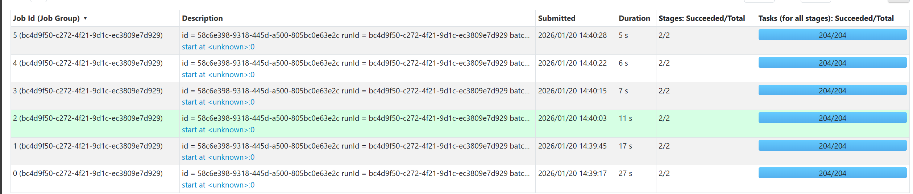

Time of a single run:
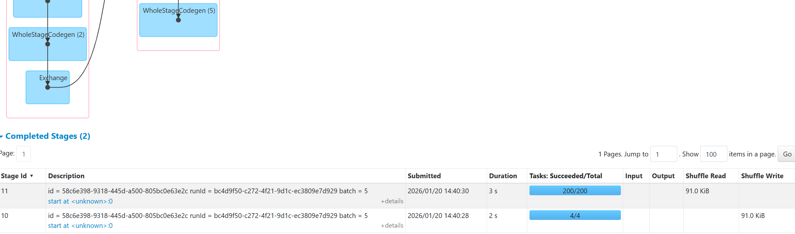

Processing speed (input vs processed):
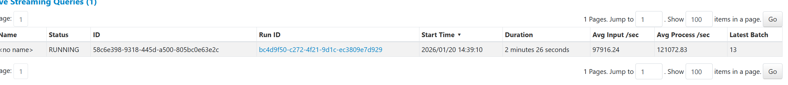

Resource usage:
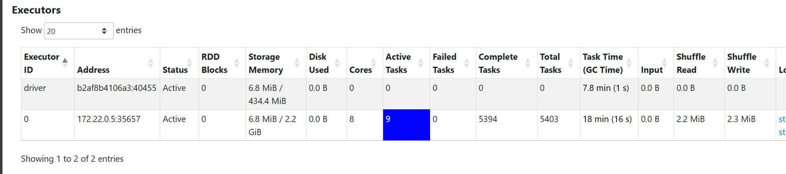

### Observations
- Single executor with 8 cores handles moderate load effectively
- State size fits comfortably in 4G memory
- 30-second watermark balances late data handling and memory usage

## Step 8: Possible Scaling

### Scaling
- Increase executors to distribute load across machines
- Kafka partitions distributed to Spark tasks
- State partitioned by `(window, user_id)` keys
- **Best practice:** `num_kafka_partitions ≥ num_executor_cores`

## Clean up the ```load-generator``` folder under ```logs-processing```.
```bash
docker compose down -v
```